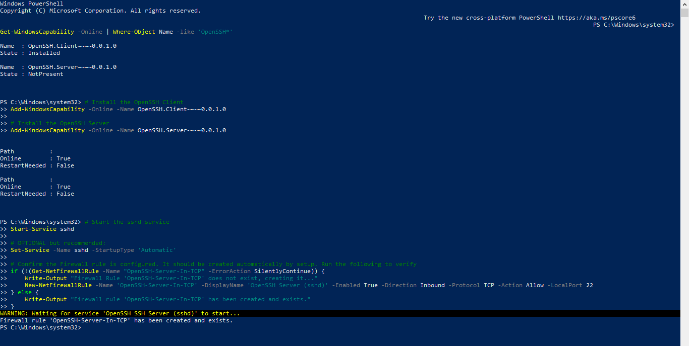
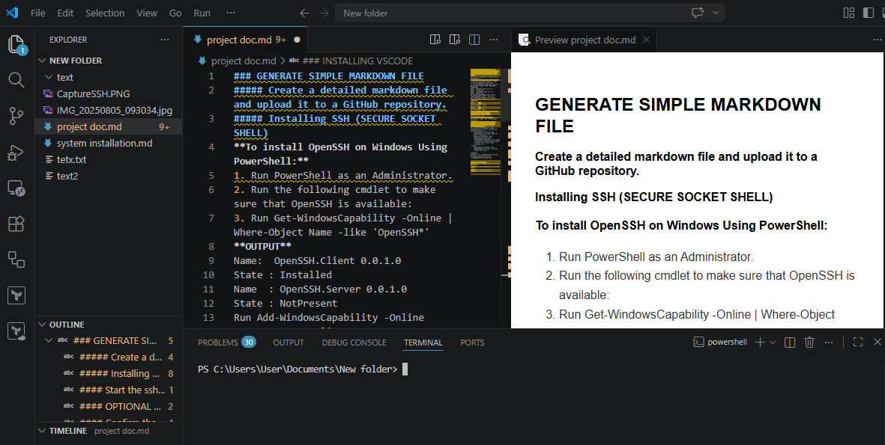
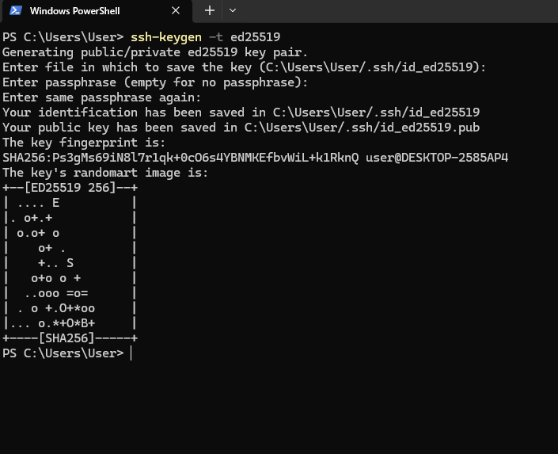

### GENERATE SIMPLE MARKDOWN FILE
##### Create a detailed markdown file and upload it to a GitHub repository.
##### Installing SSH (SECURE SOCKET SHELL)
**To install OpenSSH on Windows Using PowerShell:**
1. Run PowerShell as an Administrator.
2. Run the following cmdlet to make sure that OpenSSH is available:
3. Run Get-WindowsCapability -Online | Where-Object Name -like 'OpenSSH*'
**OUTPUT**
Name:  OpenSSH.Client 0.0.1.0
State : Installed
Name  : OpenSSH.Server 0.0.1.0
State : NotPresent
Run Add-WindowsCapability -Online -Name OpenSSH.Client   0.0.1.0.
Run Add-WindowsCapability -Online -Name OpenSSH. Server 0.0.1.0. 
**OUTPUT**
Path      	:
Online    	: True
RestartNeeded : False
Path      	:
Online    	: True
RestartNeeded : False
·         Run the following commands to start the sshd service:
#### Start the sshd service
Start-Service sshd
#### OPTIONAL but recommended:
Set-Service -Name sshd -StartupType 'Automatic'
#### Confirm the Firewall rule is configured. It should be created automatically by setup. Run the following to verify
if (!(Get-NetFirewallRule -Name "OpenSSH-Server-In-TCP" -ErrorAction SilentlyContinue)) {
    Write-Output "Firewall Rule 'OpenSSH-Server-In-TCP' does not exist, creating it..."
    New-NetFirewallRule -Name 'OpenSSH-Server-In-TCP' -DisplayName 'OpenSSH Server (sshd)' -Enabled True -Direction Inbound -Protocol TCP -Action Allow -LocalPort 22
} else {
    Write-Output "Firewall rule 'OpenSSH-Server-In-TCP' has been created and exists."

**OUTPUT**
Firewall rule 'OpenSSH-Server-In-TCP' has been created and exists.

### INSTALLING VSCODE
•	Download VSCODEUSERSETUP FILE from the portal
•	Install the Executable file on the system.
•	Install VS code Extenions
•	Create workspace folder.

#### SETUP SSH KEY
**To generate key files by using the ECDSA algorithm**
Run the following command in a PowerShell:       ssh-keygen -t ed25519

**OUTPUT**

###SSH AGENT
To configure the ssh-agent service to start automatically each time your computer is restarted, and to use ssh-add to store the private key, run the following commands at an elevated PowerShell prompt on your server:
By default, the ssh-agent service is disabled. Configure it to start automatically.
Run the following command as an administrator.
Get-Service ssh-agent | Set-Service -StartupType Automatic
**Start the service.**
Start-Service ssh-agent
**The following command should return a status of Running.**
Get-Service ssh-agent
**Load your key files into ssh-agent.**
ssh-add $env:USERPROFILE\.ssh\id_ecdsa
**OUTPUT**

[def]: CaptureSSH.PNG